# Functional Specification – Serverless HR Lookup Application

**Student Name:** Sravani Gurram

**GitHub Repository URL:**  
[Cloud Computing Assignment Repository](https://github.com/Gurram-sravani/Cloud_Computing_Assignment--2-)

## 1. Architecture Diagram

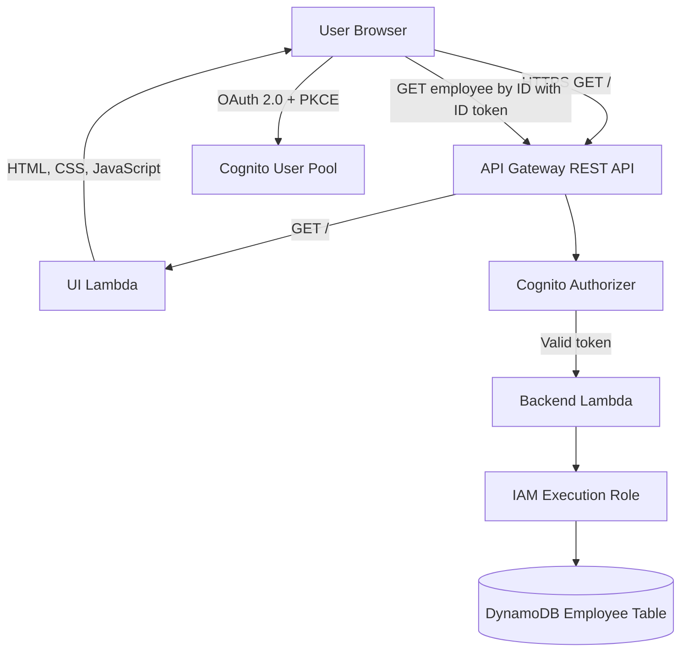

The browser does not access DynamoDB directly. Employee data is retrieved only by the backend Lambda function through its IAM execution role.

## 2. Authentication Flow

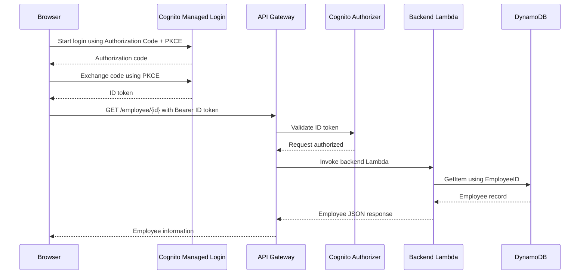

The application uses the Cognito ID token in the `Authorization` header:

```text
Authorization: Bearer <Cognito ID token>
```

The access token is not used for the employee lookup request.

## 3. Deployed Resource Details

| Item | Value |
|---|---|
| API Gateway URL | [https://ec0nt4zxta.execute-api.us-east-1.amazonaws.com/prod/](https://ec0nt4zxta.execute-api.us-east-1.amazonaws.com/prod/) |
| Cognito Managed Login Domain | [https://hr-lookup-sravani.auth.us-east-1.amazoncognito.com](https://hr-lookup-sravani.auth.us-east-1.amazoncognito.com) |
| Cognito Client ID | `7ksoktbmg46oj2hhs26qvlmuio` |
| Cognito User Pool ID | `us-east-1_DJNvZ52aK` |
| Cognito User Pool Subject UUID (`sub`) | `147844f8-a0b1-705a-28b6-ac3d0e54b2a0` |
| AWS Account ID | `329504364784` |
| Deploying IAM User ARN | `arn:aws:iam::329504364784:user/saathi-deployer` |

No Cognito client secret is included in this document or repository.

## 4. Test Evidence

### Test 1 – Application Access

The application UI loads successfully over HTTPS at the deployed API Gateway URL.

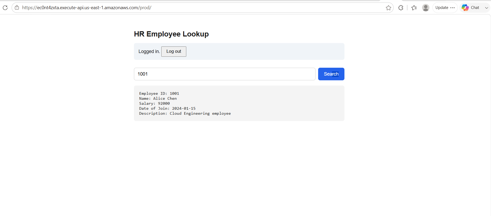

### Test 2 – User Authentication

The Cognito Managed Login page allows a valid user to authenticate using the OAuth 2.0 Authorization Code flow with PKCE.

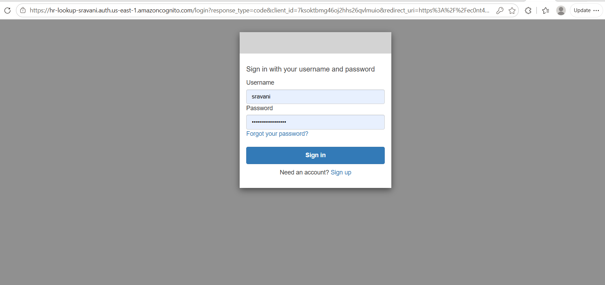

### Test 3 – Valid Employee Lookup

Searching for Employee ID `1001` returns the complete employee record, including Employee ID, Name, Salary, Date of Join, and Description.


### Test 4 – Student Employee Record

Searching for Employee ID `1005` returns the student employee record containing the student's name and AWS user ARN in the Description field.

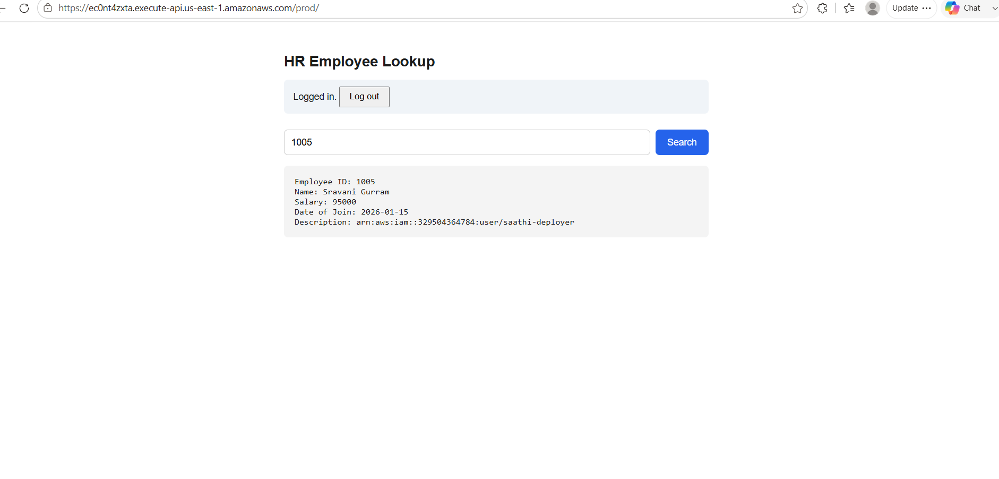

### Test 5 – Invalid Employee ID

Searching for nonexistent Employee ID `999` returns an appropriate employee-not-found error without exposing unrelated employee information.

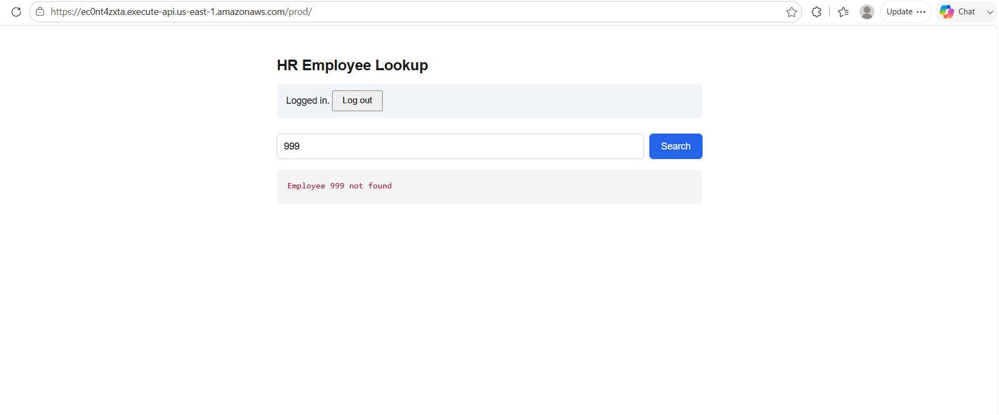

### Test 6 – Unauthorized API Access

Calling `GET /employee/{id}` without a valid Cognito ID token is rejected by API Gateway with `401 Unauthorized`.

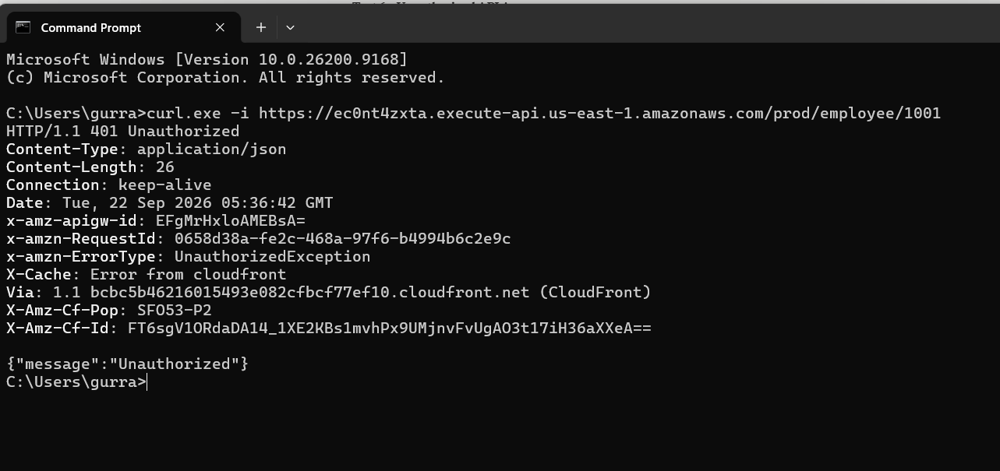

## 5. AWS Service Configuration Evidence

### DynamoDB Employee Table

The DynamoDB table uses `EmployeeID` as its partition key. Each employee record contains:

- `EmployeeID`
- `Name`
- `Salary`
- `DateOfJoin`
- `Description`

The table contains five sample employee records, including the required student record.

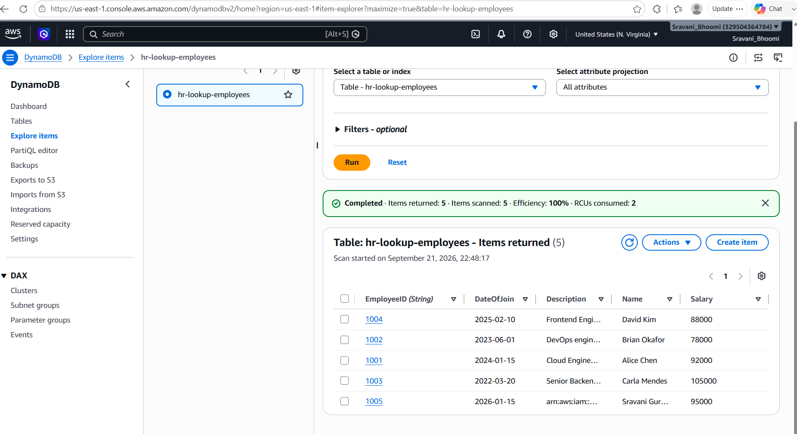

### UI Lambda

The UI Lambda function, `hr-lookup-ui`, serves the HTML, CSS, and JavaScript application through API Gateway.

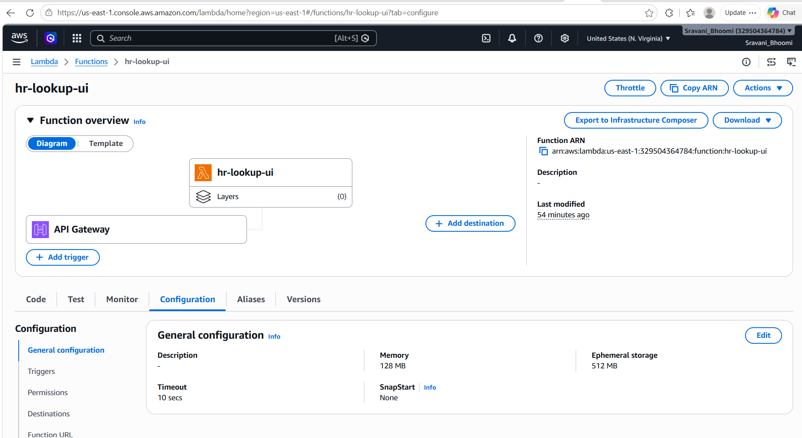

### Backend Lambda

The backend Lambda function, `hr-lookup-backend`, retrieves employee data from DynamoDB using a key-based lookup.

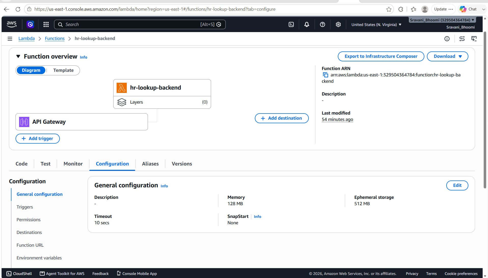

### API Gateway Resources

The API Gateway REST API contains:

- `GET /`
- `GET /employee/{id}`

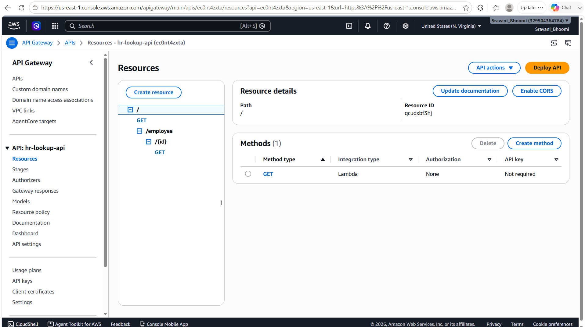

### Cognito Authorizer

The `GET /employee/{id}` method is protected by the Cognito user-pool authorizer named `hr-lookup-cognito-authorizer`.

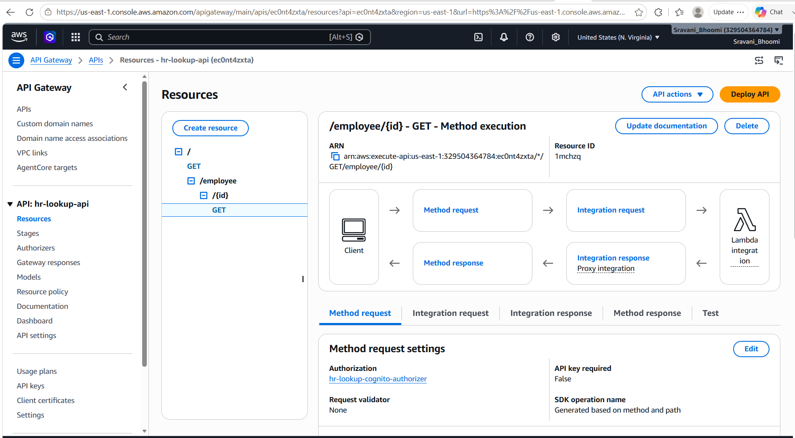

### Cognito User Pool

The application uses an Amazon Cognito User Pool with Managed Login and a public application client without a client secret.

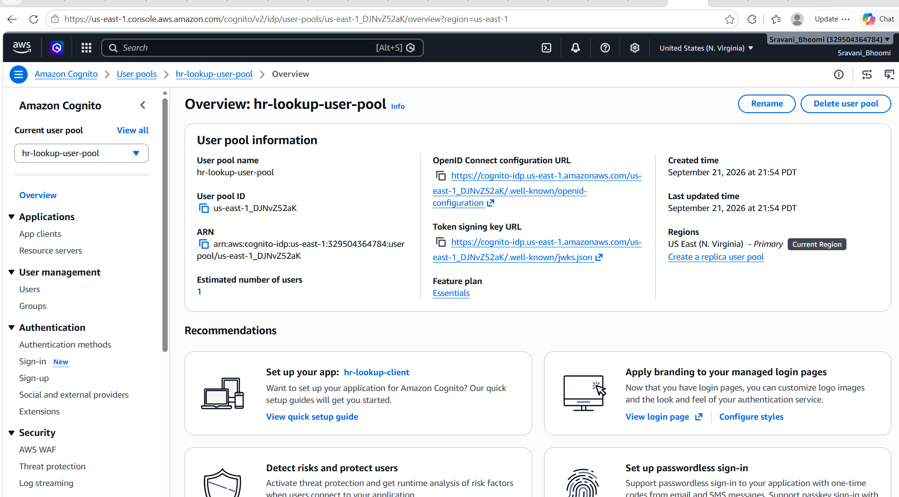

### Decoded Cognito ID Token

The decoded JWT confirms that the frontend sends an ID token to API Gateway. The token payload contains:

- `token_use: "id"`
- Correct Cognito issuer
- Correct audience/client ID
- User subject UUID

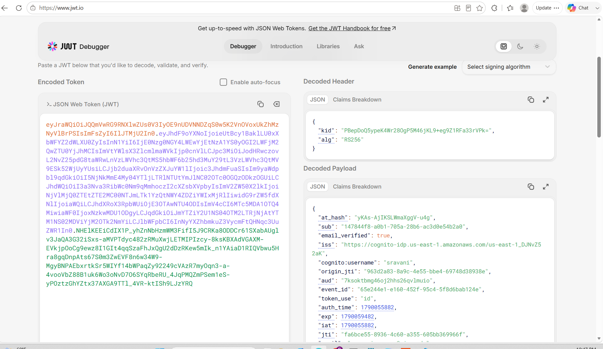

## 6. Exported API Gateway Definition

The exported API Gateway REST API definition is available in:

```text
docs/apigateway-export.json
```

The export was created from the API Gateway console using the deployed `prod` stage.

## 7. IAM Least-Privilege Configuration

The backend Lambda uses a dedicated IAM execution role.

The role allows only the DynamoDB operation required for the employee lookup:

```text
dynamodb:GetItem
```

The permission is restricted to the employee DynamoDB table. AWS credentials are not stored in the application source code.

## 8. DynamoDB Student Record

The student record uses Employee ID `1005`.

The record contains:

```json
{
  "EmployeeID": "1005",
  "Name": "Sravani Gurram",
  "Salary": 95000,
  "DateOfJoin": "2026-01-15",
  "Description": "arn:aws:iam::329504364784:user/saathi-deployer"
}
```

## 9. AI Tools Used

Claude, an Anthropic AI assistant, was used during the assignment to:

- Scaffold Terraform infrastructure for DynamoDB, IAM, Lambda, Cognito, and API Gateway
- Generate the backend Lambda employee lookup logic
- Generate the UI Lambda and frontend authentication logic
- Implement OAuth 2.0 Authorization Code flow with PKCE
- Debug PowerShell, Terraform, Python, and deployment issues
- Interpret API Gateway, Lambda, Cognito, DynamoDB, and JWT test results
- Review the functional specification and documentation

All generated code and infrastructure were reviewed, deployed, and manually tested by the student. Tests 1–6 were executed against the deployed AWS resources.

## 10. Resource Cleanup

After completing testing and capturing the required evidence, unnecessary AWS resources should be deleted or disabled to avoid unexpected charges.

Resources to review include:

- API Gateway API and stages
- Lambda functions
- DynamoDB table
- Cognito User Pool and application client
- IAM roles created for the assignment
- Any additional resources created during deployment